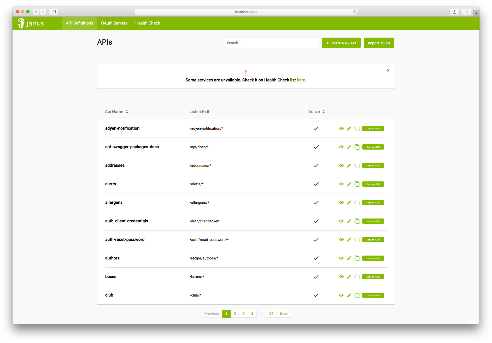

[](https://travis-ci.com/hellofresh/janus-dashboard)

# Janus-Dashboard
**Janus Dashboard** is a web-based UI for [Janus][1]. It allows users to easily configure the API Gateway without having to send HTTP calls manually.



## Getting Started
A quick way to start the dashboard is to run the [docker image][2].
Execute the following command to start the dashboard using the latest Docker image:

```sh
docker run -d \
-p 8082:80 \
-e REACT_APP_JANUS_URI=http://localhost:8081 \
--name janus-dashboard \
quay.io/hellofresh/janus-dashboard
```

### Advanced Configuration
Janus Dashboard supports authentication using [GitHub][3] and other options configurable by setting the environment variables.
An example command can be seen below:

```sh
docker run -d \
-p 8082:80 \
-e REACT_APP_JANUS_URI=http://localhost:8081 \
-e REACT_APP_DISABLE_BASIC_AUTH=true \
-e REACT_APP_CLIENT_ID=exampleClientId \
-e REACT_APP_SCOPE=read:org \
-e REACT_APP_JANUS_TOKEN_URL=http://localhost:8081 \
-e REACT_APP_GITHUB_TOKEN_URL=http://localhost:8080/auth/github/token \
-e REACT_APP_GITHUB_AUTHORIZE_URL=http://localhost:8080/auth/github/authorize \
--name janus-dashboard \
quay.io/hellofresh/janus-dashboard
```

Supported environment variables:
 - `REACT_APP_DISABLE_BASIC_AUTH` removes the option of basic authentication if set to `true`
 - `REACT_APP_DISABLE_GITHUB_AUTH` removes the option of GitHub authentication if set to `true`
 - The following environment variables are required for GitHub authentication
   - `REACT_APP_CLIENT_ID`
   - `REACT_APP_JANUS_TOKEN_URL`
   - `REACT_APP_GITHUB_TOKEN_URL`
   - `REACT_APP_GITHUB_AUTHORIZE_URL`
   - `REACT_APP_CLIENT_ID`
   - `REACT_APP_SCOPE`

## Development

### With Docker
The following command will start Janus Dashboard server and the latest version of Janus with the default username `admin` and password `admin`:

```sh
$ docker-compose -f tests/docker-compose.test.yml up -d
```

### Without Docker
The following command will start only Janus Dashboard:

```sh
$ npm install
$ npm run start
```

[1]: https://github.com/hellofresh/janus
[2]: https://quay.io/hellofresh/janus-dashboard
[3]: https://hellofresh.gitbooks.io/janus/quick_start/authenticating.html
